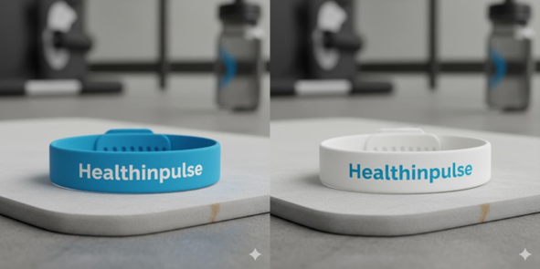

# 🩺 HealthInPulse

  

---

## 👥 Integrantes

- Igor  
- Kauê Souza  
- Matheus Moura  
- Murylo Amaral  
- Pedro Henrique Camacho  

---

## 👨‍🏫 Professores Orientadores

- Allan Roberto Molto  

---

## 🎨 Design

  

---

## 📌 Apresentação do Projeto

O **HealthInPulse** é uma proposta de solução tecnológica voltada para o monitoramento contínuo da saúde, apresentada no contexto acadêmico com foco em inovação e prevenção.

A ideia consiste no desenvolvimento de uma pulseira inteligente capaz de coletar dados fisiológicos em tempo real e fornecer informações relevantes ao usuário.

---

## 🚨 Problema

- Diagnósticos tardios  
- Identificação de doenças em estágios avançados  
- Aumento de custos com tratamentos  
- Impactos na qualidade de vida  

---

## 💡 Proposta de Solução

O HealthInPulse propõe uma abordagem baseada em **monitoramento contínuo e preventivo**, permitindo acompanhar indicadores de saúde em tempo real.

A solução é integrada ao aplicativo **Blua**, possibilitando a visualização dos dados e recebimento de alertas.

---

## ⚙️ Funcionamento

O sistema funciona em quatro etapas principais:

1. Coleta de dados por sensores:
   - Temperatura corporal  
   - Batimentos cardíacos  
   - Pressão arterial  
   - Movimento  

2. Envio dos dados para processamento  

3. Análise das informações coletadas  

4. Geração de alertas e insights ao usuário  

---

## 🧠 Análise dos Dados

Com base nos dados coletados, o sistema permite:

- Identificação de padrões anormais  
- Geração de recomendações personalizadas  

---

## 🔮 Considerações Finais

O projeto reforça a importância da evolução do modelo atual de saúde, propondo uma transição de um sistema reativo para um sistema **proativo e orientado a dados**.

---

## 🚧 Status do Projeto

Projeto acadêmico desenvolvido na FIAP para apresentação à empresa Care Plus.
