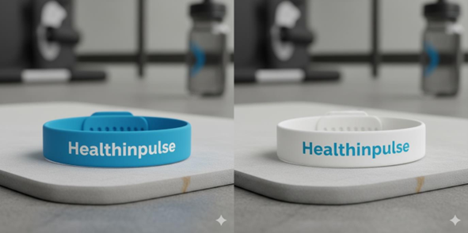

# 🩺 HealthInPulse

<p align="center">
  
</p>

---

# 📌 Sobre o Projeto

O **HealthInPulse** é uma solução acadêmica desenvolvida na FIAP com foco em monitoramento inteligente de saúde em tempo real.

O projeto propõe o desenvolvimento de uma pulseira inteligente integrada a um dashboard web capaz de monitorar indicadores fisiológicos e gerar alertas preventivos.

---

# 🚀 Tecnologias Utilizadas

- React
- Vite
- JavaScript
- CSS
- Recharts
- Git/GitHub

---

# 👥 Integrantes

- Igor  
- [Kauê Souza](https://www.linkedin.com/in/kau%C3%AA-souza/)  
- [Matheus Moura](https://www.linkedin.com/in/mmoura97/)  
- Murylo Amaral  
- [Pedro Henrique Camacho](https://www.linkedin.com/in/pedro-henrique-camacho-14a13b345/)  

---

# 👨‍🏫 Professores Orientadores

- [Allan Roberto Molto](https://www.linkedin.com/in/allan-roberto-molto-80b85617/)

---

# 🎨 Design do Projeto

<p align="center">
  
</p>

<p align="center">
  <sub>Imagem ilustrativa do conceito da pulseira HealthInPulse</sub>
</p>

---

# ⚙️ Funcionalidades

✅ Dashboard de monitoramento  
✅ BPM em tempo real  
✅ Controle de passos  
✅ Controle de calorias  
✅ Simulação de emergência  
✅ Gráficos dinâmicos  
✅ Modal de dados  
✅ Layout responsivo  
✅ Arquitetura React organizada  
✅ Preparado para integração IoT  

---

# 🧠 Objetivo do Projeto

O projeto busca transformar o modelo tradicional de saúde reativa em um sistema preventivo baseado em dados em tempo real.

A ideia é permitir:

- monitoramento contínuo
- detecção de padrões anormais
- geração de alertas
- acompanhamento remoto
- integração futura com sensores IoT

---

# 🧱 Arquitetura do Projeto

```bash
src/
 ├── components/
 ├── hooks/
 ├── pages/
 ├── services/
 ├── styles/
```

---

# 🔧 Instalação Completa do Projeto

## 1️⃣ Instalar Programas Necessários

Antes de começar, instale:

- Node.js
- Git
- VSCode

---

## 2️⃣ Clonar o Repositório

Abra o terminal e execute:

```bash
git clone
```

---

## 3️⃣ Entrar na Pasta do Projeto

```bash
cd Healthinpulse/healthinpulse-web
```

---

## 4️⃣ Instalar Dependências

```bash
npm install
```
---

## 5️⃣ Instalar Biblioteca de Gráficos

```bash
npm install recharts
```

---

## 6️⃣ Rodar o Projeto

```bash
npm run dev
```

---

## 7️⃣ Abrir no Navegador

Acesse:

```txt
http://localhost:5173
```

---

# 🛠️ Caso o npm apresente erro no Windows

Abra o PowerShell como administrador e execute:

```powershell
Set-ExecutionPolicy RemoteSigned -Scope CurrentUser
```

Depois confirme digitando:

```powershell
Y
```

---

# 🚧 Status do Projeto

🟡 Em desenvolvimento — MVP funcional.

---

# 🔮 Próximas Implementações

- Integração ESP32
- Firebase
- API REST
- Banco de dados
- Alertas inteligentes
- Dashboard em tempo real
- Aplicativo mobile
- Machine Learning

---

# 📄 Licença

Projeto acadêmico desenvolvido para fins educacionais na FIAP.
